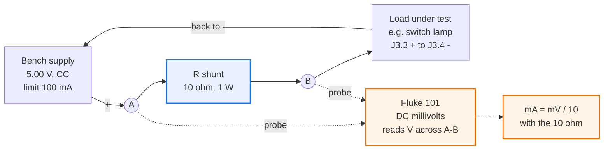

# Bring-up runbook

**How to prove a fabricated caryatid board works, from the antistatic bag to a
Daisy Seed running `panel_readout`.**

First batch: five boards, JLCPCB order of 2026-08-23, ENIG, Economic assembly
top side, arrived 2026-09-01. Nothing in this repository has ever been powered.
**Every number below is predicted from the schematic and the design documents,
and none of it has been seen on hardware.** That is what running this is for.

> **A platform artifact, not a loa document.** Four more boards and every future
> batch use it. Keep instrument-specific steps out.

## How to use this

**This file is the reference and is never filled in.** Readings go on a dated
sheet generated from it:

```sh
python3 tools/gen_bringup_sheet.py            # writes today's blank sheet
python3 tools/gen_bringup_sheet.py --phase B  # just one phase
```

The sheet lands in `discovery/evidence/` with a dated filename. **Revise this
file, regenerate the sheet.** That is the whole reason the sheet is generated
rather than hand-written: the two used to drift apart every time the runbook
changed, and they did.

Each phase declares a **scope** line, which the generator reads to decide
whether a step gets one column or five.

---

# Phase A: Preparation

> **Scope:** bench

Nothing here touches a board.

## A1. The five rules

1. **Never power a rail you have not proved is not shorted.** Phase B exists
   entirely for this, and it is the phase with no glamour and the highest value.
2. **Every pass criterion is a number.** "Looks right" is not a result. A step
   that does not say what to expect is not finished being written; say so rather
   than inventing a threshold at the bench.
3. **Record as you go, per board.** A runbook with no record is a runbook you
   run twice.
4. **Stop at the first red gate.** Do not press on to see whether the next thing
   also fails. The failure modes here are cumulative: a shorted rail that
   survives one phase destroys a part in the next.
5. **One board all the way before the other four.** You are proving the runbook
   as much as the hardware, and debugging five boards at once is debugging none.

## A2. Instruments, and what they cannot reach

Recorded in [`bench-instruments`](../discovery/findings/bench-instruments.yaml),
which is what every reading in this project should be traceable to.

| instrument | |
| --- | --- |
| **Fluke 101** | DC volts, resistance, diode, continuity. 🔴 **No current ranges at all.** Excellent at millivolts: 0.1 mV on the 600 mV range |
| **Jesverty 0-30 V 0-5 A** | Selectable CC/OCP, encoder with coarse and fine. Arrived 2026-09-06 |
| **10 Ω and 0.1 Ω shunts** | 1 W or better. How current gets measured |

**What no amount of care reaches, with this kit:**

| out of reach | consequence |
| --- | --- |
| Boost switching node and ripple | U2 could run badly and still read 5.0 V DC |
| Inrush and start-up transient | A marginal soft-start shows only as an occasional failure to come up |
| RC debounce timing on the 74HC14 | ADR 0007's 24 ms stays unverified; firmware may need tuning |
| Audio noise floor and THD | You will know audio *works*, not how well |
| I2C and SPI signal integrity | Works or does not; no margin measurement |

**Record these as untested, never as passed.** A record that omits them reads as
though they were checked.

## A3. Measuring current with no ammeter

Current is either read off the supply or derived from a **shunt voltage**: a
known resistor in series, millivolts across it, Ohm's law.

**The supply reads amps well and milliamps badly**, and the work divides on that:

| current | how | why |
| --- | --- | --- |
| **around 1 A**, charge and input | **the supply's display** | well inside its accuracy on a 5 A range, and nothing goes in series |
| **tens of mA**, lamp and quiescent | **10 Ω shunt, Fluke on DC mV** | a 5 A supply's error at 15 mA is comparable to the quantity itself. The Fluke reads 150 mV at 0.1 mV resolution, which is not close |

| shunt | at the expected current | conversion |
| --- | --- | --- |
| **10 Ω** | 15 mA gives 150 mV | `mA = mV ÷ 10` |
| **0.1 Ω** | 1.0 A gives 100 mV | `mA = mV × 10` |

Current flows **through** the shunt. The meter sits **across** it and carries
almost none. That reads oddly the first time, because the instinct with an
ammeter is to break the circuit and insert it; here you insert a resistor and
watch it from the side.



🔴 **Do not put the Fluke where the shunt is.** With no current ranges it is an
open circuit on volts, not a reading. The resistor does the work; the meter
only watches it.

**Why 0.1 Ω for the big one and not something easier to read.** It sits in the
input path and its drop comes out of the charger's headroom, which is only 150
to 250 mV. At 1.05 A a 0.1 Ω drops 105 mV and leaves J1 near 4.90 V, above the
4.75 V floor. A 1 Ω would drop a volt, stop the charger, and give you a careful
measurement of a charger that is not charging.

## A4. The supply, and why 5 V

**Set 5.00 V and leave it there for the whole runbook.**

The stated 5 to 9 V input range is what the part tolerates, not a set of equally
good choices. **The bq24074 is a linear charger**: it burns the difference
between input and cell in its own package.

| supply | at the IC | cell 3.0 V | cell 3.7 V | cell 4.2 V |
| --- | --- | --- | --- | --- |
| **5.0 V** | 4.60 V | 1.60 W | **0.90 W** | 0.40 W |
| 9.0 V | 8.60 V | 5.60 W | **4.90 W** | 4.40 W |

A QFN-16-EP on 2-layer FR4 has roughly 1.2 W of budget. 5 V sits inside it and
charges at the full 1 A; 9 V is four times over, and the part protects itself by
folding the charge current back. Nothing is damaged, but you get a hot charger
and most of a day to fill a cell. Derivation and the caveat on the estimated θJA
are in
[`charger-input-voltage-thermal`](../discovery/findings/charger-input-voltage-thermal.yaml).

With no cell fitted there is no charge current and therefore no heat, so Phases
B and C are indifferent to it. Leaving the supply at 5.00 V throughout is simply
one less thing to remember at C3.

**The service supply is a different thing and stays.** A 5 V 3 A wall adapter and
a 5.5 × 2.1 mm panel jack are what the *instrument* runs from through J1. The
bench supply replaces them only for bring-up.

## A5. Rigs to build

**One thing is worth building, and it serves two connectors.**

| # | Build | Pass |
| --- | --- | --- |
| A5.1 | **Bus breakout.** IDC 2×5 ribbon, 2×5 socket one end, 10-pin 0.1 inch header the other, pressed into a breadboard | seats in the breadboard, all 10 conductors beep through |
| A5.2 | **Analogue injector.** 10 kΩ pot on the breadboard, ends to `3V3A` and `AGND` from the breakout, wiper on a flying lead | pot sweeps 0 V to 3V3 measured at the wiper |
| A5.3 | **Ground stick.** A jumper from breadboard GND, for pulling digital lines down one at a time | beeps to GND |
| A5.4 | **Loopback wires.** One short jumper each for UART and SPI | beep through |

**J5 and J11 are both IDC 2×5, so one breakout serves both.** The pinouts differ
completely; the adapter does not care and you read the pins differently. This is
the single highest-value rig and it is reusable for absonus and baby borg.

**A pot rather than fixed dividers**, because sweeping it catches a stuck or
noisy ADC that three static points would pass.

**Two connectors test themselves and need no hardware.** A loopback costs one
wire and exercises the whole path:

- **UART** on J19 (`D11`/`D12`) and J15 (`D13`/`D14`): TX to RX, firmware sends
  and expects to receive.
- **SPI** on J16: MOSI (`D10`) to MISO (`D9`), firmware writes and reads back.

**Bought, not built:** a common-anode RGB LED for J12, headphones or a powered
speaker for J17, the electret for J18, and optionally a Qwiic device for J13,
which is the only honest test of it as real I2C.

## A6. Cables to build

Pin assignments from [power-sheet.md](power-sheet.md),
[panel-io-sheet.md](panel-io-sheet.md) and [connectors.md](connectors.md).
🔴 **The board silkscreens all 77 connector pins. At the bench, read the board.**

### Wire colour convention

Colours on a *bought* harness mean nothing, which is why the loa keypad map had
to be by header position. On a cable you make, the opposite is available: colour
carries meaning and the cable documents itself at the panel.

| | 1 | 2 | 3 | 4 |
| --- | --- | --- | --- | --- |
| **J1** | +ve **red** | GND **black** | | |
| **J3** | VOUT **red** | EN_SW **yellow** | lamp anode **orange** | lamp cathode **black** |
| **J4** | anode **white** | /CHG **red** | /PGOOD **green** | GND **black** |
| **J12** | +5V **white** | red **red** | green **green** | blue **blue** |
| **J17** | L **white** | R **red** | GND **black** | |
| **J18** | L **white** | R **red** | MIC_RTN **green** | |

Two deliberate departures from red-is-positive:

**The LED cables put the common anode on white**, so the cathode colours can
match the dies. At a panel, a red wire going to the red die is worth more than a
red wire meaning "supply", because the supply pin is the one you can always
identify anyway: it is the odd one out.

🔴 **J18 pin 3 is green and must never be black.** `MIC_RTN` is not a ground.
`connectors.md` already had to correct this exact error in its own table. A
black wire there re-creates the mistake in copper and invites the next person to
tie it to the nearest ground by reflex. It is the whole reason J14 exists.

### The cables

| # | Cable | Wiring | Needed by |
| --- | --- | --- | --- |
| A6.1 | **J1 power in**, 2-way | 1 positive to supply +, 2 GND | **C1** |
| A6.2 | **J3 bare link**, 2 wires | J3.1 to J3.2 only, nothing else | **C2** |
| A6.3 | **J3 latch switch**, 4-way | 1,2 to the unlabelled pins; 3 to `+`, 4 to `-` | panel |
| A6.4 | **J4 charge LED**, 4-way | 1 anode, 2 /CHG cathode, 3 /PGOOD cathode | **C4** |
| A6.5 | **J12 RGB**, 4-way | 1 anode +5V, 2 red, 3 green, 4 blue cathodes | E7 |
| A6.6 | **J14 shorting link**, 2-way | pins bridged | **E8, before any mic test** |
| A6.7 | **J18 mic**, 3-way | electret red to pin 1 or 2, black to pin 3 | E8 |
| A6.8 | **J17 audio out**, 3-way | L, R, GND to jacks or headphones | E8 |
| A6.9 | **J8 hook switch**, 2-way | to the hook switch COM and NC | loa build |
| A6.10 | **J11 keypad**, IDC 2×5 | to JST ZH 7-way. 🔴 **cross positions 5 and 7** | loa build |

**Make A6.2 before A6.3.** Phase C1 passes on the 5 V rail being *dead* and C2
needs it live, so a bare link makes that a deliberate act and keeps the lamp out
of the boost test. Two unknowns at once is how a bench evening disappears.

**No resistors go in any cable.** R5, R9, R10 and the RGB's 510/300/300 are all
on the board.

### Crimping and verifying

**Re-pin rather than re-make.** JST-XH contacts have a small retention lance; a
fine pick releases the contact, so a pigtail in the wrong order is fixed in a
minute rather than cut off.

🔴 **Beep out every cable before it is plugged in.** Every cable, every time,
bought pigtails included. A mis-pinned J1 lead puts the supply somewhere it does
not belong, on a board that has never been powered, at the exact moment you are
establishing whether the board is sound. An unverified power cable destroys the
whole value of Phase B.

**Label each cable with its J number.** J3, J4 and J12 are all 4-way JST-XH with
completely different jobs and are indistinguishable in a drawer.

## A7. Component checks, before they reach a panel

Each of these costs a part if it is wrong, and none is recoverable after.

| # | Check | Pass |
| --- | --- | --- |
| A7.1 | **Switch lamp limits its own current.** J3.3 feeds +5V through R5, and R5 is a **0 Ω link** | a lamp rated as a *voltage range* is internally limited. ✅ **PASSED**: 12 mm latching, marked 3-6 V, 4 pins, contacts 0.9 Ω latched and open out, ran at 5 V undamaged. See [`panel-latch-switch`](../discovery/findings/panel-latch-switch.yaml) |
| A7.2 | **Charge LED is common anode** | diode test: a common anode conducts with the **red** probe on the common pin |
| A7.3 | **Charge LED green die is AlGaInP, not InGaN** | 🔴 J4 runs from `VOUT`, the cell falling to 3.0 V. AlGaInP at ~2.1 V is fine; **InGaN true green at 3.0-3.2 V dims and goes dark as the cell drains** and no resistor fixes it |
| A7.4 | **RGB is common anode** | same diode test. 🔴 It cannot run from 3V3: green and blue Vf is above the output-high level |
| A7.5 | **Test electret characterised** | DC resistance both ways, a finite kΩ that **differs by direction**, which is the built-in JFET. Tells you which lead is positive. See [`bench-test-electret`](../discovery/findings/bench-test-electret.yaml) |
| A7.6 | **Switch lamp current** | 10 Ω shunt at 5 V. Closes one of three unattributed lines in the 5 V budget in [values.md](values.md) |

**A7.5 first, before it is trusted.** Its job is to tell you whether the board
works, and an unmeasured reference cannot. If E8 reads nothing there are three
suspects: board, capsule, wiring. Measuring it removes one for a minute's work.
**Prove the test article, then use it to prove the board**, exactly as D1 proves
the Seed before it goes near the socket.

## A8. Consumables

- [ ] Bench supply, **5.00 V, limit 100 mA, CC not OCP**
- [ ] Fluke 101, **clip leads**. Hand-held probes on a pad is how the hook switch
      produced 27 kΩ from a piece of metal
- [ ] 10 Ω and 0.1 Ω shunts, 1 W or better
- [ ] 6 shunts per board for JP1-JP6 (Sullins SPC02SYAN, in hand)
- [ ] **BT1 holders and M3 screws.** Holders in hand; **screws still unsourced**,
      see [`bt1-cell-fit`](../discovery/findings/bt1-cell-fit.yaml). Blocks **C3
      only**
- [ ] A protected 18650, in hand. Fit confirmed 2026-09-01
- [ ] A Daisy Seed, in hand
- [ ] 🔴 **Mating cables**: JST-XH 2, 3, 4 and 6 way, JST-SH 4 way, IDC 2×5.
      Phases A to D run without them; **Phase E is where you stall**

## A9. Board identity

🔴 **The 1-5 mark is silkscreened on the breakaway rail, so it is destroyed the
moment you depanel.** It is permanent ink on a part of the board that is
designed to be thrown away, which is worse than a sticker: a sticker looks
temporary and this looks trustworthy right up until the rail snaps off.

| # | Do | Pass |
| --- | --- | --- |
| A9.1 | **Transfer the number onto the board proper**, in marker on the bottom silkscreen, away from any pad | five boards identified independently of their rails |
| A9.2 | Photograph each board **with its rail and mark still attached and legible** | the photo is the record tying board N to that rail |
| A9.3 | Only then consider depanelling | see below |

`mark_on_pcb: "Remove Mark"` in the order means JLC's *order number* is not
printed, and `depanel_and_edge_rail_before_delivery: false` means the rails came
attached. So the rail is JLC's, the 1-5 on it is the only thing distinguishing
five otherwise identical boards, and it is on the disposable part.

**Boards that become indistinguishable halfway through turn a batch fault into a
flaky board.** A9.1 costs a minute and removes that entirely.

### When to depanel, and how

**Keep the rails through Phases B and C.** They protect the edges, and they give
you something to hold that is not the board.

**Depanel before Phase E only if a rail obstructs a connector you need**, and
before any enclosure fit check, since the rails are not part of the 150 × 90 mm
outline the BUD case and the phone shell were measured against.

🔴 **Cut, do not snap.** Flush cutters or a depanel tool, working along the
tabs. Snapping by hand flexes the board, and this board carries 64 0603
resistors and a QFN-16 whose joints do not enjoy being flexed. The damage from a
hand-snapped panel shows up later as an intermittent, which is the most
expensive kind of fault to find on a board you have already declared good.

---

# Phase B: Dead board

> **Scope:** all five boards

No power. The phase that protects every later one, and the one that reveals a
batch fault while it still costs an evening rather than a Daisy Seed.

## B1. Inventory and visual

| # | Do | Pass |
| --- | --- | --- |
| B1.1 | Count the boards | 5 |
| B1.2 | Photograph both faces, in focus, whole board, **rail and its 1-5 mark legible** | filed in `discovery/evidence/`. This photo is what ties board N to its rail once the rail is gone |
| B1.3 | Part census by sweep band, below | 127 present |
| B1.4 | **BT1 absent** | absent, it is `self_fit` |
| B1.5 | **JP1-JP6 bare**, no shunts fitted | bare |
| B1.6 | Solder bridges, tombstones, skewed parts | none |
| B1.7 | **U1 QFN-16, U2 SOT-563, U3, U4 orientation** vs `local/fab/board-top.png` | pin 1 as drawn |
| B1.8 | **C7 polarity**, the 100 µF electrolytic | band to the marked pin |
| B1.9 | **IDC pin-1 and JST polarity on J5 and J11** | as drawn. `sourcing.md` flags these: the footprints came from absonus, which proves they *fabricate*, not that they are right |

**Photograph before handling.** A photo of an undamaged board is available once.

### The sweep bands

127 parts, generated from `local/fab/cpl.csv`. Sweep from the J1 end to the J15
end band by band rather than hunting designators.

| band | n | parts |
| --- | --- | --- |
| **1** J1 end | 41 | C1 D1 J1 R4 R3 R2 U1 R1 C3 C2 J3 C9 R18 R14 J4 R15 R16 R5 R9 R17 R6 R8 R7 R10 FB1 U2 C6 C5 C4 L1 C19 R34 R35 C20 R36 R37 J11 C21 R38 R39 J6 |
| **2** | 14 | A2 R42 A1 C7 R27 R28 R29 R30 R31 C18 J16 U3 J7 J8 |
| **3** | 19 | R11 R12 R13 C8 C15 C17 C16 C14 R25 R26 R24 R41 R40 R23 R43 R32 R33 J19 J15 |
| **4** | 15 | C12 C11 C10 C13 R22 R21 R20 R19 JP1 JP2 JP3 C24 R67 J9 **R45** |
| **5** | 10 | J13 R44 J5 JP4 JP5 JP6 C28 R68 R46 J10 |
| **6** J15 end | 28 | J12 R49 R47 J17 J18 J14 C30 R52 R51 R58 C22 C25 C23 R55 R56 R63 R57 U4 R61 R65 C27 R59 R60 C26 C29 R62 R54 R53 |

**R45 earns a second look.** Band 4, beside J9/J10. It is the one part where the
file and reality were known to disagree, a half-turn pad rotation fixed
2026-08-22. Harmless by geometry, worth a glance in the flesh.

🔴 **Gate: record faults, fix nothing yet.** Finish all five first. The same
defect on several boards is a batch fault, and a quick fix erases the evidence.

## B2. Rail to ground

Meter in resistance, probing at connector pins rather than fine-pitch parts.

🔴 **The bulk capacitors will fool you.** C1-C6 are 10 to 22 µF and C7 is 100 µF.
The meter's test current charges them, so a rail-to-ground reading **starts low
and climbs**. That looks exactly like a short. **A real short sits at its value
and does not move; a capacitor climbs.** Discharge the rail between readings or
the next one starts where the last stopped.

**Probe one polarity first** (red on rail, black on GND). A high settled reading
is a pass and needs nothing more. Reverse **only** where it reads low.

- low one way, high the other → a semiconductor junction. **Normal.**
- low **both** ways → 🔴 short.

| # | Rail | Reach it at |
| --- | --- | --- |
| B2.1 | `VIN_DC` | J1 |
| B2.2 | `VBAT` | BT1 pads |
| B2.3 | `VOUT` | J3, J4 |
| B2.4 | `+5V` | J12 pin 1 |
| B2.5 | `+3V3` | J16 pin 2 |
| B2.6 | `+3V3A` | J9 pin 1, J10 pin 1 |
| B2.7 | `+3V3D` | J11 pin 1 |

🔴 **Gate: any rail under ~10 Ω settled in both polarities stops that board.**

## B3. Rail to rail

A bridge between adjacent connector pins shows here and not in B2, because both
ends are live rails and neither is ground.

| # | Pair |
| --- | --- |
| B3.1 | `+5V` to `+3V3` |
| B3.2 | `+3V3` to `+3V3A` |
| B3.3 | `+3V3A` to `+3V3D` |
| B3.4 | `VOUT` to `+5V` |

`+3V3`, `+3V3A` and `+3V3D` are **separate nets** and must not read as one.

## B4. Ground continuity

| # | Do | Pass |
| --- | --- | --- |
| B4.1 | J5 pin 10 to J11 pin 10 | near 0 Ω |

`AGND` and `DGND` are one net here. **An open reading is as much a fault as a
short**: the ground stitching was one of the last things done to this board.

## B5. D1 orientation

| # | Do | Pass |
| --- | --- | --- |
| B5.1 | Diode test across D1 forward | **0.2 to 0.4 V.** A Schottky, *lower* than silicon's 0.6 V. Near 0.6-0.7 V means it is not the part you think |
| B5.2 | Reverse | open |

Reversed, D1 blocks the input instead of protecting it and the board never
powers. That failure is silent and looks like a dead board.

## B6. Seed socket

40 joints across A1 and A2. Where a bridge is most likely and most expensive,
because the part you would destroy plugs into it.

| # | Do |
| --- | --- |
| B6.1 | No adjacent pins bridged, A1 |
| B6.2 | No adjacent pins bridged, A2 |
| B6.3 | A1 row not shorted to A2 row |

🔴 **Gate: all five boards pass B1 to B6 before any board is powered.**

---

# Phase C: Power

> **Scope:** board 1

## C1. First power

No cell. No Seed. No shunts fitted.

**Set 5.00 V, limit 100 mA, CC not OCP.** Switch on and read the front panel.

| what the supply shows | means |
| --- | --- |
| 5.00 V holding, a few mA, **CV** lit | healthy idle board |
| voltage collapsed, current pinned at 100 mA, **CC** lit | 🔴 **short.** Switch off, find it |

**CC and not OCP, deliberately.** Constant current holds the board *powered* at
a safe current so a fault can be probed while it misbehaves. OCP trips off and
tells you only that something is wrong. Keep OCP for a known-good circuit left
unattended, such as a charging cell.

**100 mA is chosen to be obviously wrong for this board.** A healthy caryatid
here draws a few mA. If the supply will not set that low, that is a fault in the
supply, not a reason to raise it.

| # | Measure | Expect |
| --- | --- | --- |
| C1.1 | Supply current at idle | a few mA, **CV** lit |
| C1.2 | `VOUT` at J3 or J4 | present, stable, below the input, around 4.4 to 4.5 V |
| C1.3 | `/PGOOD` at J4 | asserted |
| C1.4 | `+5V` at J12 pin 1 | 🔴 **dead, and that is correct** |
| C1.5 | Board temperature by hand | nothing warm. A warm QFN with no load is a fault |

### C1.4 is the step people fail

**The 5 V rail is supposed to be dead here.** The latching panel switch asserts
the boost's enable and R6 is a 100 kΩ pulldown holding it off. With no switch
fitted, U2 never starts. **A dead 5 V rail at this stage is the design working**,
and it looks exactly like a dead boost. C2 is where you find out which.

## C2. The boost

Still no cell, still no Seed.

| # | Do | Expect |
| --- | --- | --- |
| C2.1 | Fit the **J3 bare link** (A6.2), pins 1 to 2 | |
| C2.2 | `+5V` at J12 pin 1 | **4.954 V nominal**, accept **4.744 to 5.168 V** |
| C2.3 | `+5V` at J15, J16, J19 | same, within meter resolution |
| C2.4 | Across FB1 | tens of mV at most |
| C2.5 | Supply current | risen, modest with no load |
| C2.6 | U2 and L1 by hand | warm acceptable, hot is not |

The band is the divider tolerance from [values.md](values.md), R7 348 kΩ and R8
47.5 kΩ. **A reading inside it is a pass even if it is not 5.00 V.** Reading 4.95
and "correcting" it is how a good board becomes a bad one.

🔴 **Not verified here and must be recorded as such:** ripple, switching
frequency, load transient. DC being right does not establish that U2 switches
cleanly.

## C3. BT1 and the cell

🔴 **Blocked until the M3 screws arrive.** Nothing else is.

BT1 is `self_fit`: two through-hole joints, `VBAT` and `GND`, plus two M3 holes
at 55.610 mm. **Fit it last of all parts** per `self-fit.csv`: tallest thing on
the board, spans 72.9 mm, obstructs everything under it once fitted.

| # | Do | Expect |
| --- | --- | --- |
| C3.1 | Solder BT1, then **repeat B2.2 for `VBAT`** | no short. You just added two joints to a rail a cell will drive |
| C3.2 | Cell open-circuit voltage before fitting | 3.0 to 4.2 V, note it |
| C3.3 | Seat the cell, watching orientation | seats without forcing. Fit confirmed 2026-09-01 |
| C3.4 | `VBAT` at the holder | matches C3.2 |
| C3.5 | Supply **out**, check `VOUT` | alive, running from the cell |
| C3.6 | J3 link on, check `+5V` | inside the band, now boosted from the cell |

**C3.6 is the real test of the power architecture**: the first time the board has
run on battery alone, which is how it will spend its life.

## C4. Charging

| # | Do | Expect |
| --- | --- | --- |
| C4.1 | 🔴 **Raise the supply limit to 1.5 A**, still 5.00 V | the charger needs far more than 100 mA |
| C4.2 | Supply in, cell fitted, partially discharged | `/CHG` asserts at J4 |
| C4.3 | Charge current, off the supply display | **0.90 to 1.10 A**. Cross-check with the 0.1 Ω if marginal |
| C4.4 | `VBAT` over some minutes | rising |
| C4.5 | Total input current | under the **1.29 A** input limit |
| C4.6 | U1 case after ten minutes steady | warm, not hot. **Closes [`charger-input-voltage-thermal`](../discovery/findings/charger-input-voltage-thermal.yaml)** |

The 0.90 to 1.10 A band is wide **and that is not slop in the resistor**. R3 is
887 Ω at 1%, but `KISET` spans 797 to 975 AΩ, so the spread is the bq24074's.

🔴 **Do not leave a charging cell unattended on a board being brought up for the
first time.** Everything about the charge path is unproven until C4 completes.

---

# Phase D: The Seed

> **Scope:** board 1

## D1. The Seed, on its own

**Independent of the board. Do it whenever, before D3.** This separates a *board*
fault from a *toolchain* fault, which are indistinguishable from the far side of
a socket.

| # | Do | Pass |
| --- | --- | --- |
| D1.1 | Install the ARM toolchain, build libDaisy | builds clean |
| D1.2 | Flash the stock blink example over USB | LED blinks |
| D1.3 | Flash something using `StartLog` and print | text over USB serial |
| D1.4 | Build `firmware/examples/panel_readout.cpp` | **compiles**, not yet run |

**D1.4 has never been done.** `firmware/README.md` says the code is a stub that
has never been on hardware. Expect build errors, and treat them as expected work
rather than as a discovery about the board.

## D2. The socket, Seed still out

Powered, Seed **not** inserted. The last chance to catch a fault before risking a
Seed in it. Pin roles from [seed-sheet.md](seed-sheet.md), not from memory.

| # | Measure at the socket | Expect |
| --- | --- | --- |
| D2.1 | The pin feeding the Seed its input power | `+5V`, inside the band |
| D2.2 | Every ground pin | 0 Ω to ground |
| D2.3 | `3v3A`, socket pin 21 | 🔴 **absent, and that is correct** |
| D2.4 | Any other pin against ground | no rail where a GPIO belongs |

### D2.3 is the counterpart of C1.4

**`+3V3A` originates at the Seed, not on the board.** It leaves on pin 21 and
feeds the J5 pot tops, J9 and J10. With the Seed out, `+3V3A` and `+3V3` are
dead. **If you measure 3V3 anywhere with the Seed out, something is feeding it
that should not be**, and that is worth chasing before inserting a Seed into it.

## D3. Seed in, first boot

| # | Do | Expect |
| --- | --- | --- |
| D3.1 | Power down fully. Insert the Seed, watching orientation | seats fully |
| D3.2 | Power up with the limit at **500 mA**, still CC | sane current, **CV** stays lit |
| D3.3 | `+3V3` and `+3V3A` | both now present |
| D3.4 | Flash `panel_readout` | runs |
| D3.5 | Open USB serial | readings once per second |

🔴 **Gate: the board talks.** Everything after this is coverage rather than
survival.

---

# Phase E: Functional sweep

> **Scope:** board 1

Full platform coverage, including what loa will never use. A fault in an unused
corner is still a fault, and absonus or baby borg will find it later at much
greater cost. **Needs the rigs from A5 and the cables from A6.**

## E1. Analogue bus, J5

`A0`-`A3` then `A6`-`A9`, **not** `A0..A7`. `A4` and `A5` are not on the bus.
1 kΩ/100 nF per wiper, board side.

| # | Do | Expect |
| --- | --- | --- |
| E1.1 | Bus breakout on J5, pot wiper to each channel in turn | each reads 0 V to 3V3 as swept |
| E1.2 | Sweep one channel and watch all eight | 🔴 **only the expected channel moves.** This is what catches a swapped pair |

## E2. Dedicated analogue, J9 and J10

`A5` soft pot, 3 kΩ pulldown. `A4` FSR, 10 kΩ pulldown.

| # | Do | Expect |
| --- | --- | --- |
| E2.1 | Read A4 and A5 with **nothing plugged in** | a defined low value, not floating. An open reading means a pulldown is missing |
| E2.2 | Inject with the pot on each | tracks |

## E3. Battery gauge, A10

| # | Do | Expect |
| --- | --- | --- |
| E3.1 | Compare reported value against `VBAT` at the holder | **pin reads half the cell**, 100 k/100 k, firmware reports the doubled figure |

A factor-of-two error here is the easiest bug on the board to write and the
hardest to notice.

## E4. Charge status, A11

Four levels, from [indicators.md](indicators.md). You can produce three by
pulling the supply in and out at different states of charge.

| `/CHG` | `/PGOOD` | State | Level |
| --- | --- | --- | --- |
| high-Z | high-Z | idle, on battery | **3.300 V** |
| high-Z | low | external power, not charging | **2.200 V** |
| low | high-Z | charging | **1.650 V** |
| low | low | charging, external present | **1.320 V** |

| # | Do | Expect |
| --- | --- | --- |
| E4.1 | Produce each reachable state | level within ~100 mV |
| E4.2 | Decode | **by nearest level, not thresholds.** Minimum separation 330 mV, 409 ADC counts against noise of a few |

## E5. Digital bus, J11

`D0`-`D6`, 100 Ω series each.

| # | Do | Expect |
| --- | --- | --- |
| E5.1 | Ground each line in turn with the ground stick | the expected bit changes, and **only** that bit |
| E5.2 | Optionally plug in the loa keypad through the ZH harness | a confirmed 4×3 exercises the bus as the instrument will. See [`loa-keypad-matrix`](../discovery/findings/loa-keypad-matrix.yaml) |

## E6. Switches, J6 J7 J8

🔴 **Two traps, both documented and both easy to trip.**

- **They read inverted.** The 74HC14 is an inverter, so the GPIO is **high when
  the switch is closed**. A switch that reads backwards is correct.
- **SW1 and SW2 cross.** SW1 is on `D14`, SW2 is on `D13`. Not a typo.

| # | Do | Expect |
| --- | --- | --- |
| E6.1 | Short J6, J7, J8 in turn | the right bit moves, high when closed |

🔴 Debounce timing is **not verified** by this and cannot be with a meter.

## E7. RGB status, J12

**Common anode to 5 V, GPIOs sinking. Writing low lights it.** Pin 1 is `+5V`,
not ground and not 3V3.

| # | Do | Expect |
| --- | --- | --- |
| E7.1 | Drive each channel low in turn | red through 510 Ω, green and blue through 300 Ω |
| E7.2 | All three together | white |

🔴 **Firmware: internal pull-up and pull-down must stay disabled on D26, D27,
D29.** They sit at the full 5 V whenever their LED is off, and `DS12556` Table 9
note 4 says a pin above 4 V needs both pulls disabled. Push-pull or open-drain,
no pull, nothing else.

## E8. Audio, J17 and J18

🔴 **Link J14 first, or the mic path cannot work.** `MIC_RTN` is not grounded on
the board: it leaves on J18 pin 3, pairs with J14, and **the board ships with
neither a link nor a wire**. With J14 open the capsule has no return path, reads
nothing, and it looks exactly like a dead U4, a dead capsule or a wrong jumper.
Three wrong suspects for a missing link.

| # | Do | Expect |
| --- | --- | --- |
| E8.1 | Fit the J14 link (A6.6) | |
| E8.2 | Tone out on J17, L and R independently | not swapped, not summed |
| E8.3 | Known signal into J18 | arrives on the right channel |
| E8.4 | Electret on J18, per A7.5 | audible, both channels in turn |

## E9. Mic configurations, JP1 to JP6

Six shunts, exactly one bias path connected at a time. Work through
[mic-configurations.md](mic-configurations.md).

| # | Do | Expect |
| --- | --- | --- |
| E9.1 | Electret left: JP1, JP2, JP3 on `1-2` | bias through R51 2k2, **1.5 mA** |
| E9.2 | Electret right: JP4, JP5, JP6 on `1-2` | bias through R53 |
| E9.3 | Each remaining documented configuration | as `mic-configurations.md` states |

## E10. Comms A, J13 and J19

Protocol-agnostic per ADR 0003. **Alternates: pick one per port and it must
match `cfg.comms_a` in firmware.**

| # | Do | Expect |
| --- | --- | --- |
| E10.1 | I2C on J13 with a Qwiic device | device enumerates |
| E10.2 | UART loopback on J19, D11 to D12 | sent bytes return |

## E11. Comms B, J15

| # | Do | Expect |
| --- | --- | --- |
| E11.1 | UART loopback on J15, D13 to D14 | sent bytes return |

🔴 **`D13`/`D14` are the same pins as SW1 and SW2.** J6/J7 and J15 are mutually
exclusive, which is why the hook switch is on SW3. Testing this means
disconnecting the switches.

## E12. Expansion, J16

| # | Do | Expect |
| --- | --- | --- |
| E12.1 | SPI loopback, D10 MOSI to D9 MISO | written bytes read back |
| E12.2 | `+5V`, `+3V3`, two grounds present | as [connectors.md](connectors.md) |

`D30` is the only spare pin on the board and it is brought out here as CS.

---

# Phase F: The batch

> **Scope:** boards 2 to 5

1. Phase B is already done on all five.
2. Take each remaining board through **C1, C2, D2, D3**: power, boost, socket,
   boot. That proves it is alive.
3. Run **Phase E only on the subsystems that board will use**, unless it is
   destined to be a spare, where D3 is a reasonable stop.

🔴 **Fix the runbook before running it four more times.** Anything wrong,
ambiguous or missing on board 1 gets corrected here, not remembered. Then
regenerate the sheets.

---

# Phase G: Recording

**One findings record per board**, `discovery/findings/board-<n>.yaml`, using the
global schema plus a `phases` block. `in-progress` while partway through;
`confirmed` only once every phase attempted has passed.

Evidence to `discovery/evidence/` with dated filenames, including the B1.2
photographs.

Three things easy to skip:

- **The actual numbers, not "pass".** 4.98 V is a fact; "5 V rail OK" is not. The
  bands are wide and the middle tells you more than the edges.
- **What was NOT tested**, explicitly. Ripple, switching, debounce timing and
  audio quality are all out of reach here, and a record that omits them reads as
  though they passed.
- **Anything this runbook got wrong.** Its first pass is as much a test of itself
  as of the board.
