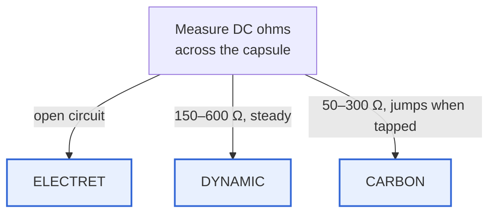
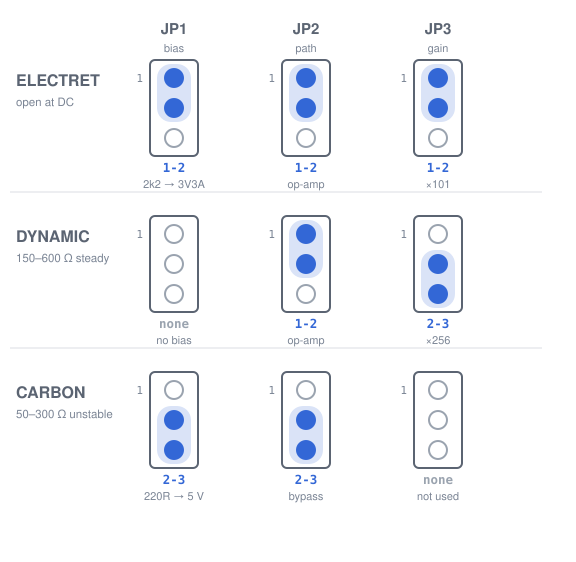
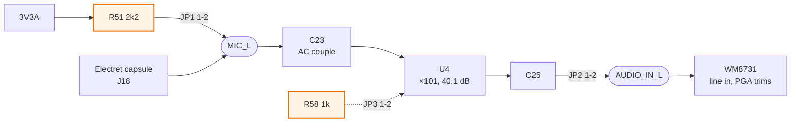
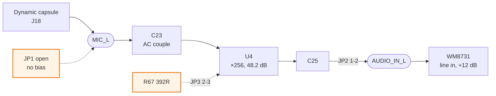
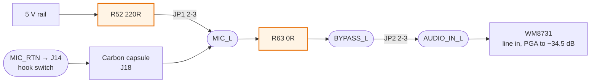

# Mic capsule configurations

**Set three jumpers to match the capsule.** This is the long form of the table
silkscreened beside the headers — same information, with the signal path drawn
so you can see what each setting actually does.

**There are two identical sets, one per channel**, and this page describes both
at once because the settings depend on the capsule, not on the channel:

| | bias | path | gain |
| --- | --- | --- | --- |
| **left** | JP1 | JP2 | JP3 |
| **right** | JP4 | JP5 | JP6 |

A handset mic is mono and uses the left channel alone. A stereo pair, or two
different elements, uses both — and the two can be set differently: an electret
on the left and a carbon on the right is a legitimate configuration.

Decision and reasoning: [ADR 0009](decisions/0009-mic-input-is-jumper-selected.md)
for the left channel, [ADR 0010](decisions/0010-nothing-is-dnp.md) for the right.
Component values and gain arithmetic: [audio.md](audio.md).

---

## First, identify the capsule

**Measure DC resistance across it.** One minute with a multimeter, and it is the
only reliable test — the three types are indistinguishable at the connector,
which is why the board cannot detect them for you.

**"Jumps when tapped" is the carbon tell.** The granules resettle, and that
variability *is* how the element works. A steady reading in the same range is a
dynamic capsule.

---

## Jumper settings

Pin 1 is uppermost on all six headers. A shunt bridges **one adjacent pair**.

> **Drawn as SVG, not Mermaid, and that was a measured decision.** Three stacked
> pin circles per jumper nested in subgraphs is the obvious Mermaid expression of
> this — and it renders at **1400 × 10993 px**, an aspect ratio of nearly 8:1,
> because nested `direction` is ignored and everything stacks into an unreadable
> column. A diagram whose entire point is spatial arrangement should not be handed
> to a layout engine that will rearrange it. `tools/gen_mic_svg.py` draws the pins
> where the pins are, from the same `CONFIG` table this page is written against.

| Capsule | bias — JP1 / JP4 | path — JP2 / JP5 | gain — JP3 / JP6 |
| --- | --- | --- | --- |
| **Electret** | `1-2` — 2k2 to 3V3A | `1-2` — op-amp | `1-2` — ×101 |
| **Dynamic** | **none** | `1-2` — op-amp | `2-3` — ×256 |
| **Carbon** | `2-3` — 220R to 5 V | `2-3` — bypass | **none** |

On the silkscreen the top pair reads `ELE` / `AMP` / `101` and the bottom pair
`CAR` / `BYP` / `256`, so the label beside the position is the setting.

---

## What each setting does

**The diagrams below draw the left channel.** The right is the same circuit with
the same values — swap `_L` for `_R` in every net name, JP1/JP2/JP3 for
JP4/JP5/JP6, and the part numbers as follows:

| | left | right |
| --- | --- | --- |
| electret bias, 2k2 | R51 | R53 |
| carbon bias, 220R | R52 | R54 |
| input coupling, 1µ | C23 | C27 |
| mid-rail divider, 100k | R55 / R56 | R59 / R60 |
| mid-rail decoupling, 10µ | C22 | C26 |
| feedback, 100k | R57 | R61 |
| gain leg ×101, 1k | R58 | R62 |
| gain leg ×256, 392R | R67 | R68 |
| gain-leg DC block, 10µ | C24 | C28 |
| output coupling, 10µ | C25 | C29 |
| bypass link, 0R | R63 | R65 |

U4 is one dual op-amp: section A is the left channel, section B the right. Both
share `+3V3A` and its decoupling capacitor C30, and both share `MIC_RTN` — one
gated return on J18 pin 3 for whatever is in the handset.

### Electret — bias, then amplify

The capsule needs a few volts through a resistor to work at all. 2k2 from 3V3A
draws about **1.5 mA**. ×101 keeps the −3 dB corner at **9.9 kHz**, which is why
the gain jumper exists — the wider bandwidth is worth having when the source is
not a telephone.

### Dynamic — no bias, maximum gain

A dynamic element generates its own signal, so bias would only load it. It wants
about **60 dB**, and one stage cannot give that without collapsing the
bandwidth — so the gain is split: **48.2 dB in the op-amp plus 12 dB in the
codec's own PGA**, confirmed against WM8731 `PD Rev 4.0` Table 3. At ×256 the
MCP6002's 1 MHz gain-bandwidth product puts −3 dB at **3.9 kHz**, just above the
3400 Hz voiceband edge.

### Carbon — DC current, and attenuate

A carbon element is effectively an amplifier: it **modulates a DC current**
rather than generating a signal, so the current has to exist. 220 Ω from 5 V
gives it tens of milliamps — and that is loud, often **above** line level, which
is why the path bypasses the op-amp entirely.

**Attenuation is the codec's job.** The board carried a resistor pad here until
[ADR 0010](decisions/0010-nothing-is-dnp.md) removed it: the WM8731's line PGA
goes down to **−34.5 dB** in 1.5 dB steps, which is more than a pad was going to
give and is adjustable while you listen rather than fixed by a soldering iron
before you have heard the capsule.

**The op-amp is not in circuit here**, so the gain jumper does nothing. Leave it
off or leave it wherever it was; it changes nothing.

> **The return is switched, and that matters.** `MIC_RTN` leaves on J18 pin 3
> and pairs with J14 to the hook switch's second pole, so the bias current only
> flows off-hook. Tens of milliamps continuously would be a real fraction of a
> battery instrument's budget, and pure waste on-hook. Electret and dynamic
> builds tie `MIC_RTN` to ground in the loom.

---

## Getting it wrong

None of these damages the board.

| Mistake | Symptom |
| --- | --- |
| bias on `2-3` with an electret | 220 Ω to 5 V into a part expecting 2k2 to 3V3 — it may survive, it will not sound right |
| bias open with an electret | **Silence.** No bias, no signal |
| path on `2-3` with electret or dynamic | Very quiet — the raw capsule straight into a line input, no gain |
| path on `1-2` with carbon | Loud and clipped — a hot source through a ×101 stage |
| gain wrong on an amplified path | Works, wrong level. Trim at the codec PGA and move on |
| the right channel's trio set for the left channel's capsule | That channel misbehaves as above; the other is unaffected. **The two sets are independent** |

**Setting one channel does not set the other.** With six headers in one area of
the board it is easy to move a shunt on JP2 while reading a row about JP5. The
silkscreen prints the designator beside each; the positions read the same on
both, which is the point, and is also what makes the mix-up possible.

**The fallback also lands on the bypass.** If the vintage element is dead, a
modern electret or a MAX9814 AGC module hidden in the housing outputs near line
level and uses the carbon settings — bias open, path on `2-3`. The board does
not change for it.