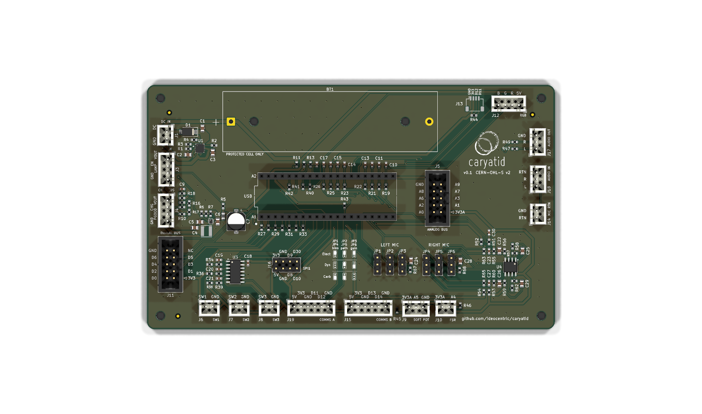

# caryatid as a platform

**A carrier board that gives a Daisy Seed a rechargeable battery, honest power
indication, and a fixed set of I/O on connectors, in a shape that drops into an
enclosure.**

That combination is the point. Plenty of Seed carriers break out pins well.
Fewer solve *running on a battery you can charge without opening the box, and
knowing what state that battery is in when the instrument is switched off*. This
board treats that as the core requirement rather than an accessory.

This page is for deciding **whether caryatid suits what you are building**. It
states what is supported, and where the boundary is. Once you have decided,
[integration.md](integration.md) is the how.

> **Every figure here is read from the board, `docs/pins.yaml`, or a record in
> [`discovery/findings/`](../discovery/findings/).** Where something has not been
> measured, it says so rather than rounding up. Anything marked ⚠️ is a claim
> nobody has verified on hardware yet.

---



## What you get

| | |
| --- | --- |
| **Module** | Daisy Seed, seated on two 1×20 sockets |
| **Board** | 150 × 90 mm, two layers, 3 mm corner radius |
| **Power in** | DC barrel jack via a 2-way connector, **5 to 9 V** |
| **Battery** | One 18650, on-board holder, charged in place |
| **Charge** | bq24074, 1 A, with power-path so the instrument runs while charging |
| **Boost** | TPS61023 to 5.0 V, so the rail holds as the cell falls |
| **Analogue in** | **10** on connectors, plus 2 consumed on-board |
| **Digital** | **19** assigned, of which 7 are a general panel bus |
| **Comms** | **2 ports**, each I2C **or** UART, not both |
| **Audio** | Line in and line out, 3-way connectors, plus a mic front-end |
| **Indication** | Switch lamp, charge LED, RGB status |
| **Firmware** | MIT-licensed stub, so your instrument code stays yours |

---

## Physical envelope

```
board            150 x 90 mm
mounting         4 x M3, 140 x 80 mm pattern, 5 mm in from every edge
board thickness  1.6 mm
tallest part     21.31 mm above the board, the 18650 holder
standoff         2 mm minimum electrical
```

The stack is **standoff + 1.6 + 21.31**, so it is not a fixed number: it is
whatever your standoff choice makes it. At 4 mm that is 26.91 mm, which is what
the BUD CU-477 figures elsewhere in this repository are quoted against.

### Keep the standoff short

**Every component is on the front face and the back is bare copper**, so the
standoff only has to clear solder joints. **2 mm is electrically sufficient.**
That is unusual and it is worth exploiting: the board can sit closer to the
floor than its component height suggests.

**Every millimetre of standoff costs a millimetre of headroom**, and headroom is
contended from above as well as below. Panel-mounted potentiometers and switches
intrude into the same space from the lid, and on a shallow enclosure they, not
the board, decide the fit.

⚠️ **4 mm standoffs are harder to source than 5 mm.** If you default to what is
on the shelf you will spend an extra millimetre without deciding to. Where
headroom is tight, source short deliberately rather than taking the common size.

### Budget for the cables, not just the board

The tallest thing in the box may not be a component. **What you plug in adds
height above the connector**, and the difference between choices is real:

| | body height above board |
| --- | --- |
| JST-XH, 2 to 6 way | **7 mm** |
| JST-SH Qwiic | 4.32 mm |

A mated housing sits on top of that, and then the wires. **Shrink-wrapped
crimps** stand a cable up rather than letting it lie down, and a **latching IDC
socket** on the 2×5 digital bus is the tall case: header, socket body, latch
ears and the ribbon's own bend radius, all stacked above the board.

**So budget 30 mm of interior height as a floor, and more depending on how you
terminate.** A build using right-angle or low-profile terminations and short
standoffs fits considerably less; one using latching IDC and shrink-wrapped JST
wants noticeably more. The board dimension is knowable in advance; your cable
choices are the variable, and they are yours.

The enclosure question this board is designed around: **can a person charge it
and see its state without opening the case?** A panel DC jack, a panel switch
with a lamp, and a charge LED on flying leads are what answer that, and all
three are on connectors rather than board-edge parts, so the panel positions are
yours to choose.

---

## Power

**Input.** **5 to 9 V** at J1, never 12 V. A series Schottky gives
reverse-polarity protection at about 0.4 V, and the charger needs 4.35 V minimum
at `IN`, so a 5 V adapter still has margin. Input over-voltage protection trips
at 10.2 to 10.8 V, which is what puts the ceiling at 9. The input current limit
is set at 1.29 A.

**Battery.** One 18650 in an on-board holder. **A protected cell is required**,
and the board says so in silkscreen: the charger protects the charge path, not
the cell, and there is no low-voltage cutoff on discharge. Over-discharge
protection comes from the cell's own PCM. See the limits section.

**Charging happens in place**, with power-path, so the instrument runs off the
adapter while the cell charges rather than fighting it.

**The 5 V rail has a real budget**, itemised in [values.md](values.md). Two
figures worth knowing before you add load: the Seed's MCU core is about 100 mA
derived (Electrosmith publish no module figure), and the mic bias pair takes
23–41 mA when carbon is selected. Check additions against that table rather than
assuming headroom.

---

## I/O

### Analogue, 10 available

Eight on the analogue bus J5 (`A0`–`A3`, `A6`–`A9`), plus `A4` on J10 and `A5`
on J9. `A4` and `A5` carry fitted pulldowns, 10 k and 3 k, so a floating wiper
reads as a defined value rather than as noise.

**Two more exist and are spent on-board:** `A10` is the battery gauge and `A11`
the charge-status code. You do not get those back.

### Digital, 19 assigned

Seven are a general panel bus on J11. The rest are allocated: three switch
inputs, three SPI1 expansion lines, three RGB drives, two comms ports, one hook
or gate input, one spare.

### Comms, two ports, and the constraint is real

Each port is **I2C1 or UART4, never both**, because they are the same two pins.
Port A appears twice, as a Qwiic connector (J13) and as a JST-XH module port
(J19); they are the same bus, so use one or the other. Port B is J15.

**There is no third UART on free pins.** If your instrument needs a third
serial device, it goes behind a module on one of these two, not on the board.

### Audio

Line in and line out on 3-way connectors, feeding the Seed's WM8731 codec.

---

## Microphone support

The board carries a mic front-end that handles **three capsule types**, selected
with three shunts per channel rather than by soldering. Both channels are fitted
on every board.

| Capsule | Bias | Path | Gain leg | Total gain |
| --- | --- | --- | --- | --- |
| **Electret** | 2k2 to 3V3A | op-amp | ×101 | ×101 |
| **Dynamic** | none | op-amp | ×256 | ×1020 with the codec's +12 dB |
| **Carbon** | 220 R to 5 V | bypass | n/a | ×1, codec trims |

### The supported range

The target is the WM8731's line input, **1.0 Vrms at 0 dB**. Against
class-typical sensitivities at 94 dB SPL:

| Capsule | Typical output | Gain needed | Provided |
| --- | --- | --- | --- |
| Electret | 5 – 17.8 mV | 56 – 200× | **×101** ✓ |
| Dynamic | 1 – 4 mV | 250 – 1000× | **×1020** ✓ |
| Carbon | 100 – 500 mV | 2 – 10× | **×1 plus PGA** ✓ |

⚠️ **Those are typical figures for a class of part, not measurements**, and the
94 dB SPL close-talk assumption is exactly that. Derivation and sources are in
[`mic-gain-budget`](../discovery/findings/mic-gain-budget.yaml), which is
`unverified` until a capsule is measured on a real board.

### Outside that range

**A source needing more than about 60 dB is not directly supported**, and the
reason is specific rather than a shrug. The WM8731's microphone path has 14 dB
nominal and 34 dB with `MICBOOST`, but **the Seed does not bring `MICIN` out**:
there is no mic pin on the 40-pin header. The line PGA's +12 dB is the only
codec-side gain there is, so 60 dB total is the ceiling and there is no hidden
reserve to fall back on.

**It extends cleanly with an external module.** A preamp ahead of J18 takes any
source into line range, and the board then treats it as line level. That is the
supported path for ribbon mics, low-output dynamics, or anything needing
phantom power.

**A source hotter than 1.0 Vrms** wants padding ahead of the board. The codec's
PGA attenuates to −34.5 dB, which covers a lot, but it cannot help a signal that
clips the input before reaching it.

---

## What this board deliberately does not do

Stated plainly, because knowing the limits before you commit is worth more than
discovering them after.

**No low-voltage cutoff on discharge.** The boost keeps pulling until it browns
out. Cell protection is the cell's own PCM, which is why a protected cell is a
requirement and not a preference. If you need a hard cutoff, it goes on the
instrument side.

**One cell, not a pack.** No balancing, no series stack, no provision for a
second cell.

**No `MICIN` path**, as above. 60 dB is the ceiling.

**No third UART**, and no I2C and UART simultaneously on the same port.

**Top-side assembly only.** Every part is on the front. That is a deliberate
choice for standoff and pour reasons, but it means the back is not available for
your own additions without a board change.

**The pin map is frozen.** That is the feature rather than a limitation, since
one layout serves every instrument, but it does mean caryatid will not move a
pin to suit a build. An instrument may leave a pin unpopulated or choose among documented
alternates; it may not reassign one.

**No MIDI DIN, no phantom power, no balanced I/O, no display connector.** Each
of those is a module on the comms or expansion port rather than a board feature.

⚠️ **Nothing here has been run on hardware.** The first five boards were ordered
2026-08-23. Every electrical check is at zero and the firmware stub compiles,
but no board has been powered.

---

## Firmware

A **MIT-licensed** stub in [`firmware/`](../firmware/), deliberately more
permissive than the rest of the repository so instrument code can link it
without inheriting copyleft.

```
include/caryatid_pins.h   generated from docs/pins.yaml, do not edit
include/caryatid.h        the Caryatid class
src/caryatid.cpp          implementation
examples/panel_readout.cpp  bring-up sketch: reads everything, prints it
```

It compiles against libDaisy and is structured for an instrument to build on.
⚠️ It has never been executed on hardware.

---

## Licensing

| What | Licence |
| --- | --- |
| Hardware: schematic, PCB, footprints, artwork | **CERN-OHL-S-2.0** |
| Tools, scripts | **GPL-3.0-or-later** |
| **Board-support firmware** | **MIT** |
| Documentation and prose | **CC-BY-SA-4.0** |

The firmware exception is the one that matters if you are building on this:
**your instrument code stays yours.** The reciprocal licences cover the board
and the tooling, not what you write against the header.

Per-file `SPDX-License-Identifier` headers are authoritative. See
[LICENSING.md](../LICENSING.md).

**If you distribute something built on this board**, note that CERN-OHL-S
defines *Complete Source* as the editable design files: shipping Gerbers alone
does not discharge it. [integration.md](integration.md) has the detail.

---

## Where to go next

| | |
| --- | --- |
| **The board as a drawing** | [reference/caryatid-board.pdf](reference/caryatid-board.pdf) |
| **The schematic** | [reference/caryatid-schematic.pdf](reference/caryatid-schematic.pdf) |
| Decided, now building | [integration.md](integration.md) |
| The frozen pin map | [pinmap.md](pinmap.md), generated from [pins.yaml](pins.yaml) |
| Connectors and what plugs in | [connectors.md](connectors.md) |
| Setting the mic jumpers | [mic-configurations.md](mic-configurations.md) |
| Component values, with derivations | [values.md](values.md) |
| Why things are the way they are | [decisions/](decisions/) |
| Board and fabrication state | [status.md](status.md) |